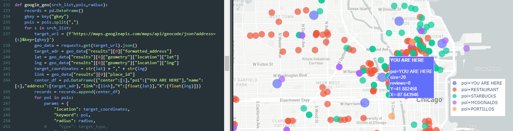
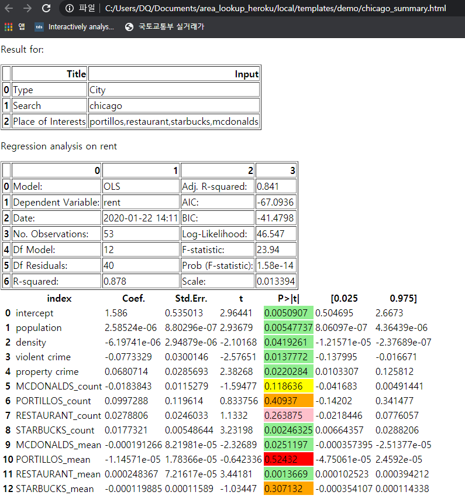

Area Lookup

This personal project started off with my curiosity out of thin air, 
"how much impact would McDonalds, Starbucks have on real estate values?"

| http://area-lookup.herokuapp.com/

* Utilizing database from: Zillow and Google GEO API,
* Webscraping crime data from : https://www.bestplaces.net/crime/
* and population density of zipcodes from : http://zipatlas.com/us/zip-code-comparison/population-density.1.htm
* Then displays the relationship between real estate values and local amenities.
* Below is example of inputs:

Pre-gathered results of major cities (http://area-lookup.herokuapp.com/demo)

Tools: Python, Flask, Pandas, statsmodel (linear regression)
